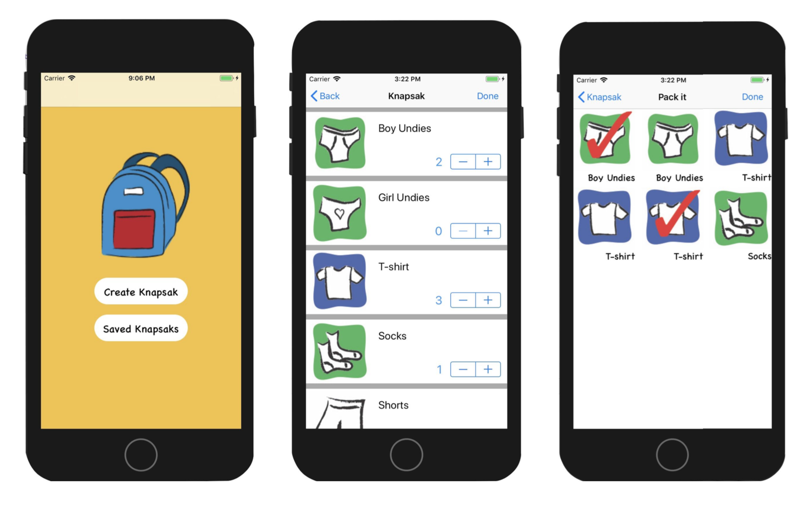

# Knapsak for iOS

#### A visual packing list for young kids.

"We are going to grandma and grandpa's. Pack up!"

I find that many times as a mom, I am not only packing for myself but I end up packing for the kids as well. There are many packing list apps out there but what if your kid is too small to read? They can still pack for a trip with a visual packing list!

Kids learn to be responsible by packing for themselves and adults are happy because it is 1 less thing off your list.

Pack up and let's go!

## Images

  

## Authors

---

Built by @CorriMori for Q4 Project at Galvanize’s Web Development Immersive.

This project uses Swift, Git, and GitHub.

---
